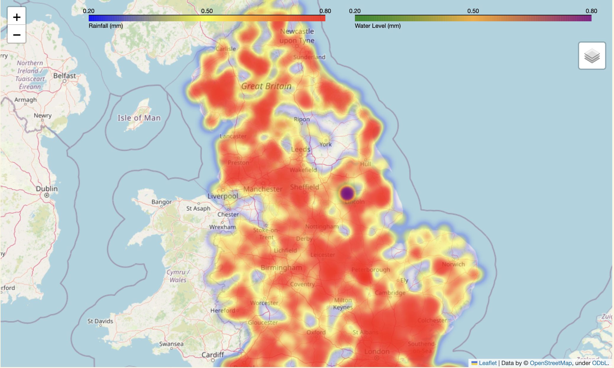
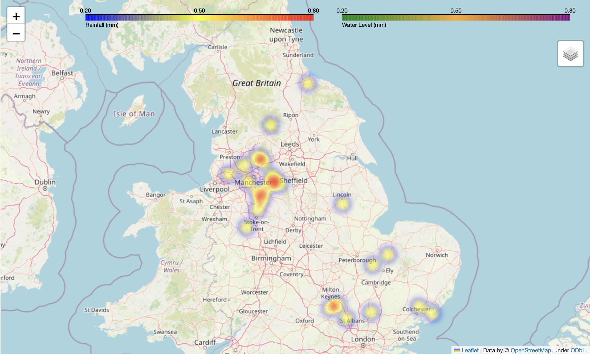
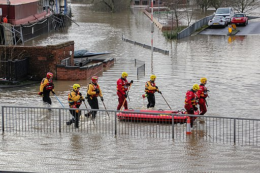

# UK Flood Risk Prediction Tool 🌊
🧙‍♀️Yiyu Yang  [[LinkedIn](https://www.linkedin.com/in/yiyu-yang/)] ✉️[Email: yangalita73@gmail.com]  
<br>
<br>
This is an interactive map webpage built using *Streamlit*. It allows users to intuitively predict and explore real-time flood risk levels in the southern regions of the UK. Additionally, users can input and search for the name of a monitoring station in the UK to view the corresponding *rainfall* and *water level* information for its location.


Detailed visualizations, explanations, and textual analyses can be found in the **Data Visualization.ipynb** report. Below is a quick display of the images included in the report:



## Synopsis
Given the global and UK distribution of human habitation, flooding is one of the most common and impactful natural distasters which can occur. [Analysis of satellite data](https://doi.org/10.1038/s41586-021-03695-w) coupled with [predictions on future changes](https://www.ipcc.ch/report/ar5/syr/) to the climate suggest this is an issue which will only get more frequent and severe.

Flooding can occur from a number of sources:

- Surface water (from rainfall run-off, or from the fresh or dirty water systems)
- Rivers, due to blockage or excess rainfall
- Seas, due to sea level rise or storm surge.

  
*_picture taken by [J. Scott](https://flickr.com/photos/60539443@N05/23675629939), used under [CC-BY](https://creativecommons.org/licenses/by/2.0/deed.en)_

Currently flood risk from these sources in the UK is assessed in a number of ways using topographic data, large, complex numerical models and a great degree of human experience. It would be useful to have rapid tools leveraging ML teachniques to update these risk assessments in piecemeal as new data is obtained.

## Purpose
The purpose of this programme is to:

  **(a) Develop ML prediction routines for flood probability and visualise their impact on the UK.**
  
  **(b) Use this tool, along with rainfall and river level data, to provide a holistic visual tool for assessing and analyzing flood risk.**

## Quick Start ✨
1. **Clone the repository:**

   ```bash
   git clone https://github.com/ese-ada-lovelace-2024/ads-deluge-jubilee.git
   cd ads-deluge-jubilee
   ```
2. **Create a new Conda environment and install the dependencies:**
    ```bash
    cd UK_Flood_Risk
    conda create -n flood python=3.9
    conda activate flood
    conda env update -f environment.yml
    ```

3. **Run the prediction model:**
    ```bash
    python run_model.py
    ```

4. **Result Visualization:**
- You can view the visualizations through the project's Jupyter Notebook:  
_./Data Visualization.ipynb_  
- or interact directly by running our webpage:  
  ```bash
  streamlit run WebPage.py
  ```
## License

This project is licensed under the MIT License. See *LICENSE* for details.  


<br></br>
---
The topic of this programe was proposed by [James Percival](https://www.imperial.ac.uk/people/j.percival),
[Parastoo Salah](https://www.imperial.ac.uk/people/p.salah)
and
[Marijan Beg](https://profiles.imperial.ac.uk/m.beg) from [Imperial College London](https://www.imperial.ac.uk/).